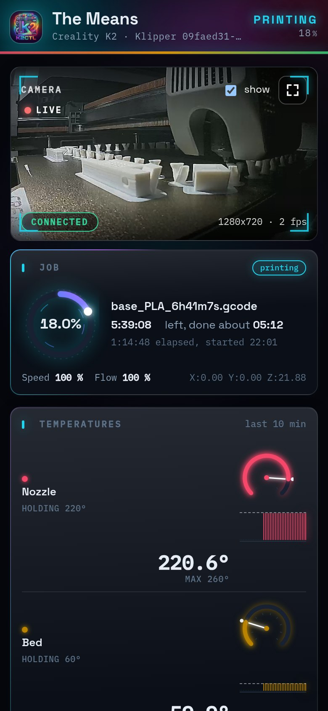
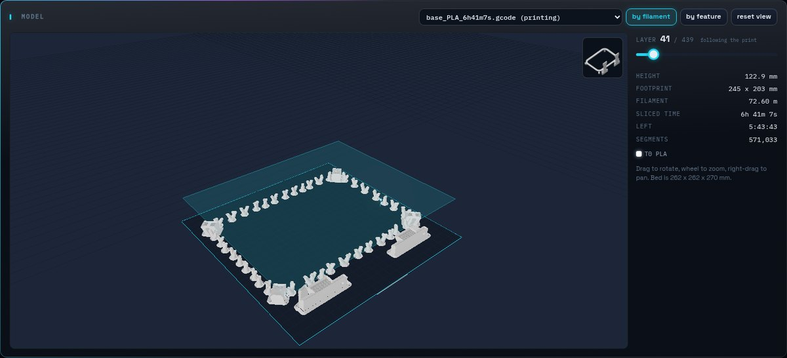
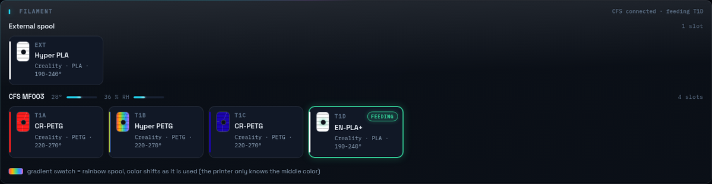
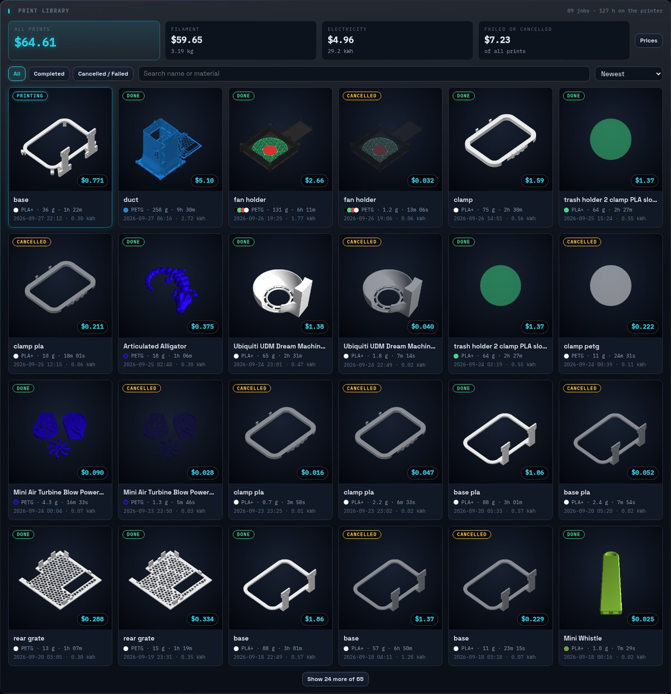
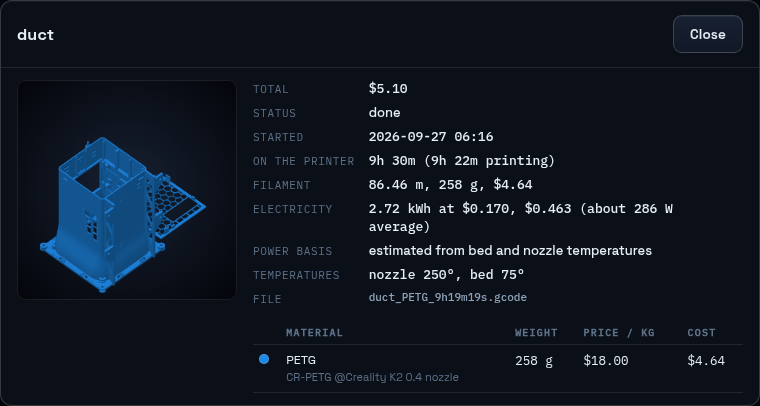
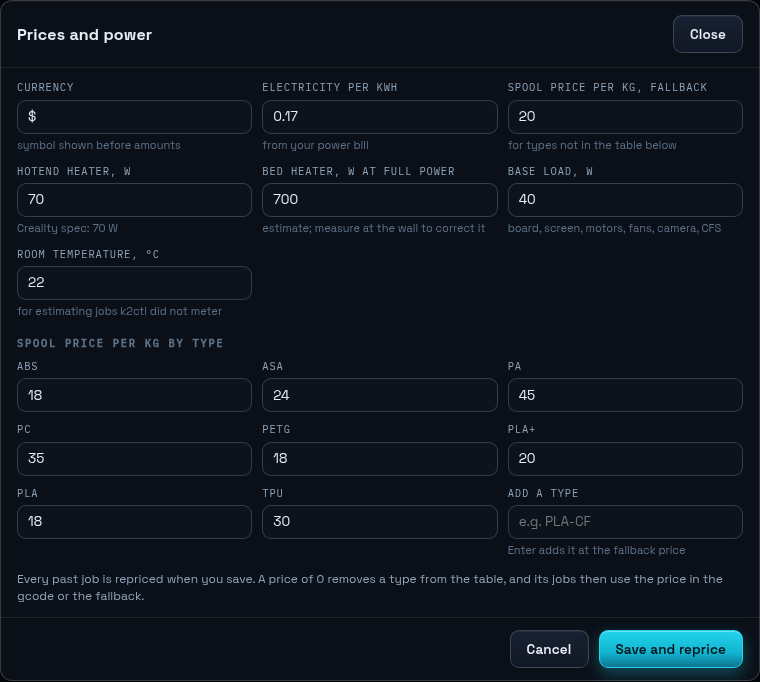
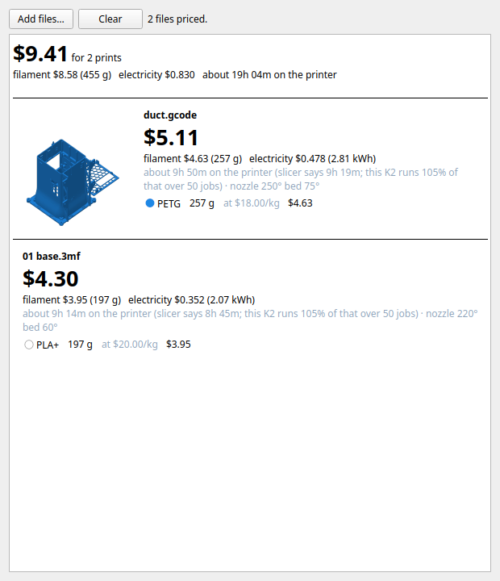

<h1 align="center">
  <br>
  
  <br>
  k2ctl
  <br>
  <sub><em>a dashboard, tray app and print cost tracker for the Creality K2 and its CFS</em></sub>
  <br>
</h1>

<p align="center">
  <a href="#install">Install</a> &bull;
  <a href="#screenshots">Screenshots</a> &bull;
  <a href="#print-costs">Print costs</a> &bull;
  <a href="#the-tray-app">Tray app</a> &bull;
  <a href="#api">API</a> &bull;
  <a href="#troubleshooting">Troubleshooting</a> &bull;
  <a href="#faq">FAQ</a>
</p>

<p align="center">
  <a href="#install"></a>
  <a href="#lan-only"></a>
  
</p>

<p align="center">
  <a href="https://go.dev"></a>
  <a href="https://react.dev"></a>
  <a href="https://threejs.org"></a>
  <a href="https://qt.io"></a>
  <a href="https://moonraker.readthedocs.io"></a>
  
  <a href="LICENSE"></a>
  
</p>

> k2ctl runs on the printer itself. It gives you a web dashboard for any browser on your home
> network, a system tray app for your Linux desktop, a record of what every print cost in
> filament and electricity, a cost estimate for files you have not printed yet, and a
> filament catalog that knows third-party spools and what does not belong in the CFS.

> **Not a Creality product.** Written for our own K2, "The Means". It talks to the
> Klipper/Moonraker and Creality services already on the printer and does not use the
> Creality cloud.

<a id="lan-only"></a>

> [!CAUTION]
> ## Do NOT put this on the internet
>
> **k2ctl has no login and no password.** Anyone who can reach it can cancel your print,
> run any gcode, turn the heaters up, and watch your camera. That is fine on your home
> network and a bad day anywhere else.
>
> - **Do NOT forward ports to it.** Not 8085, not 443, and not the printer's own 7125, 9999
>   or 4408 either.
> - **Do NOT put it behind a public reverse proxy or tunnel** (Cloudflare Tunnel, ngrok and
>   the like).
> - **Want it while you are out?** Use a VPN back to your house (WireGuard, Tailscale, your
>   router's built-in VPN), or just wait until you get home.
>
> The printer's own services have no real protection either, so the same goes for the K2 itself.

---

## Contents

<details>
<summary>Click to expand</summary>

- [What it does](#what-it-does)
- [Screenshots](#screenshots)
- [Requirements](#requirements)
- [Install](#install)
- [Using it](#using-it)
  - [The dashboard](#the-dashboard)
  - [The tray app](#the-tray-app)
- [Print costs](#print-costs)
- [Pricing a file before you print it](#pricing-a-file-before-you-print-it)
- [Configuration](#configuration)
- [How it works](#how-it-works)
- [API](#api)
- [What it touches on the printer](#what-it-touches-on-the-printer)
- [Building by hand](#building-by-hand)
- [Troubleshooting](#troubleshooting)
- [FAQ](#faq)
- [Credits and dependencies](#credits-and-dependencies)
- [Contributing](#contributing)
- [License](#license)

</details>

---

## What it does

| Part | What you get |
|---|---|
| **Dashboard** | Live camera, the current job with a progress ring and finish time, temperature histograms, pause/resume/cancel, fans, chamber climate, a 3D view of the sliced toolpath that follows the nozzle, the CFS bays, and the raw sensors. Works on a phone. |
| **Print library** | Every job the printer has run, with its thumbnail, grams per material, kWh, and what it cost. Filled in from the printer's history the first time k2ctl starts, then kept up as you print. |
| **Tray app** | Status at a glance, job controls, filament bay swaps, fans, a webcam window, a sensors window, and a cost estimator for `.gcode` and `.3mf` files. |
| **Filament catalog** | 140 profiles, Creality's and third-party, with the right temperatures and pressure advance, rainbow spools, and a warning before you load TPU or wet PVA into the CFS. |
| **JSON API** | Everything the dashboard and tray do, for your own scripts. See [API](#api). |

---

## Screenshots

<div align="center">

**The dashboard on a phone, and the 3D toolpath view and CFS bays on a desktop:**

<table>
  <tr>
    <td width="36%" valign="top"></td>
    <td valign="top">
      
      <br><br>
      
    </td>
  </tr>
</table>

**The print library, with what each job cost:**



**One job opened from the library, and the prices behind the numbers:**

| Job detail | Prices and power |
|---|---|
|  |  |

**The tray app pricing a sliced gcode and an unsliced Creality Print project:**



</div>

---

## Requirements

- **A Creality K2** (model code F021) with the root account turned on. Built and tested on the
  K2 only. The K2 Pro and K2 Plus run the same software stack but are untested.
- **A Linux desktop that uses apt** (Ubuntu, KDE neon, Debian, Mint and the like) for the
  installer and the tray app. Other distros work if you install the build packages yourself.
- **Both on the same home network.**
- For `.3mf` files in the cost estimator: **Creality Print** installed on the desktop
  (`/usr/bin/CrealityPrint` by default).

The dashboard itself works in any modern browser, on any device on your network.

---

## Install

1. On the printer's touchscreen go to **Settings > Root account** and turn it on. Write down
   the password it shows you.
2. Find the printer's IP address under **Settings > Network** on the touchscreen.
3. Open a terminal on the desktop and paste this line:

   ```bash
   curl -fsSL https://raw.githubusercontent.com/sworrl/k2ctl/master/get.sh | bash
   ```

4. It asks for the printer's IP and the root password, installs the build tools it needs
   (sudo asks for YOUR password once for that), builds everything, copies the printer part
   over, and puts a K2 icon in your system tray. The first run takes a few minutes.

When it is done:

- **Dashboard:** `http://<printer-ip>:8085` in any browser on your home network.
- **Tray icon:** left-click opens the dashboard, right-click opens the menu. It starts with
  your desktop from now on.
- **On the printer,** k2ctl starts on its own at every boot. It does not change Klipper's
  config and it never restarts Klipper.

Rather read the script before you run it? Clone first, then run the installer yourself:

```bash
git clone https://github.com/sworrl/k2ctl.git ~/k2ctl
less ~/k2ctl/install.sh
~/k2ctl/install.sh
```

**Installer options** (`./install.sh --help` lists them):

| Option | What it does |
|---|---|
| `--printer IP --password PW` | Skip the questions |
| `--desktop-only` | Just the tray app on this machine |
| `--printer-only` | Just the backend on the printer |
| `--no-autostart` | Do not start the tray with the desktop |
| `--no-apt` | Do not install packages (install them yourself first) |
| `--uninstall [--printer IP]` | Remove it from this desktop, and from the printer too with `--printer` |

**Update:** run the same install line again. It pulls, rebuilds and redeploys.

> [!WARNING]
> Keep it on your LAN. No port forwards, no public tunnels. VPN home if you want it while
> you are out. See [the warning at the top](#lan-only).

---

## Using it

### The dashboard

Open `http://<printer-ip>:8085`. Top to bottom:

| Section | What it shows |
|---|---|
| Header | Printer name, state, progress, and whether Moonraker, the device socket and the live feed are connected |
| Camera | The K2's camera over WebRTC, with a fullscreen button |
| Job | Progress ring, time left, finish time, elapsed, layer, speed and flow |
| Temperatures | Nozzle, bed and chamber with the last 10 minutes as a histogram, fans, CFS temperature and humidity |
| Controls | Pause, resume, cancel (asks first), chamber light |
| Model | The sliced toolpath in 3D, colored by filament or by feature, with the nozzle following the print live |
| Chamber and fans | Exhaust fan threshold, part/aux/case fans, the recommended fan settings for the loaded filament |
| Filament | The CFS bays and the external spool. Click a bay to set what is in it |
| Print library | Every job with its cost. See [Print costs](#print-costs) |
| Sensors | Every raw sensor Klipper and the device socket report |

### The tray app

| Action | What it does |
|---|---|
| Left-click | Open the dashboard in your browser |
| Middle-click | Open the sensors window |
| Right-click | The menu below |

The menu shows the printer state and the current job, then:

- **Filament slots:** set a CFS bay from the catalog, a custom color, or a rainbow spool
- **Pause / Resume print**, **Cancel print…** (asks first), **Chamber light**
- **Fans:** each fan on/off or a preset speed, or apply the filament's recommended settings
- **Webcam…**, **Sensors monitor…**
- **Estimate print cost…:** see [Pricing a file before you print it](#pricing-a-file-before-you-print-it)
- **Open dashboard**, **Settings…** (backend URL, poll rate), **Quit**

---

## Print costs

Every job gets a filament cost and an electricity cost, stored on the printer in
`/mnt/UDISK/k2ctl/jobs.json`. Jobs from before k2ctl was installed are filled in from
Moonraker's history the first time it starts.

**Filament** is the most accurate part:

- The length is what Klipper actually pushed through the extruder for that job, so purges,
  color-change flushes and cancelled prints count as they happened.
- The grams use each filament's density from the gcode's slicer footer. A multicolor job is
  split between spools by the slicer's per-spool lengths.
- The price per kg comes from the table under **Prices** in the library. Put in what you
  actually pay; the defaults are rough US prices and only a starting point. When a type is
  missing from the table, the price the slicer wrote into the gcode is used.

**Electricity** is a closer estimate than a flat wattage, but still an estimate:

- While k2ctl runs, it reads how hard the bed and hotend heaters are working from Klipper
  every 4 seconds and multiplies by each heater's wattage, plus a base load for the board,
  motors, fans and CFS.
- Jobs, or parts of jobs, k2ctl did not watch are estimated from the bed and nozzle
  temperatures, using holding rates learned from the jobs it did watch. The job detail says
  how much of each job was metered.
- The hotend is 70 W (Creality's spec). Creality does not publish the K2's bed wattage, so
  the 700 W default is a guess. With a plug-in power meter you can run a print, compare,
  and fix the bed and base numbers under **Prices**.

Saving **Prices** reprices every job, since k2ctl keeps the raw grams and heater readings
and works the money out from them.

---

## Pricing a file before you print it

Tray menu > **Estimate print cost…**, then pick one or more files or drop them on the
window. You can also right-click a file in your file manager and open it with
**K2 print cost**, or run `k2ctl-tray --cost FILE...` from a terminal.

| File | What happens |
|---|---|
| `.gcode` from Creality Print or Orca | Priced as is |
| `.3mf` saved after slicing | The gcode inside it is used, one result per plate |
| `.3mf` not sliced | Sliced headless with the Creality Print command line first (about 20 seconds), one result per plate |
| `.3mf` with more than one color | The Creality Print command line cannot slice these. Slice in Creality Print, export the plate gcode, and pick that |
| `.stl` | Not supported. It needs slicer settings to mean anything, so slice it first |

The estimate uses the same prices as the library. It takes the slicer's time and scales it by
how long this printer really takes against the slicer's number (the median over your completed
jobs, usually a few percent over).

On the duct from our wind tunnel project, the estimate said 257 g, 9h 50m and $5.11. The
real print used 258 g over 9h 31m and cost $5.10.

---

## Configuration

| Where | What |
|---|---|
| **Prices** in the dashboard's print library | Spool price per kg by type, electricity per kWh, heater and base wattages, room temperature, currency symbol |
| Tray menu > **Settings…** | Backend URL (`http://<printer-ip>:8085`), camera fallback URL, poll interval |
| `~/.config/k2ctl/tray.conf` | The same, plus `slicer=` (path to Creality Print for the estimator) |
| `deploy/local.env` | The printer's IP (and, for LAN HTTPS, its hostname) so the deploy scripts don't need it every time. The installer writes it; `deploy/local.env.example` shows the keys. Git ignores it |
| `deploy/profiles.json` | The filament catalog. Generated by `tools/filaments/gen_filaments.py`, which also writes matching Creality Print presets. `docs/filaments.md` has the dos and don'ts and where every number came from |

---

## How it works

```
k2ctl/
├── cmd/k2ctl/            # entry point: flags, wiring
├── internal/
│   ├── api/              # HTTP + WebSocket API, serves the embedded dashboard
│   ├── moonraker/        # polls Klipper through Moonraker (:7125)
│   ├── cxws/             # Creality's device socket (:9999): CFS, camera, device state
│   ├── jobs/             # print library: costs, backfill, thumbnails, estimator
│   ├── profiles/         # filament catalog and per-bay overrides
│   └── state/            # the merged, thread-safe printer state
├── web/                  # React + Vite dashboard (three.js for the 3D view)
├── tray/                 # Qt 6 tray app, webcam, sensors and cost windows
├── deploy/               # printer install, init script, optional LAN HTTPS, screen icon
├── tools/filaments/      # catalog and Creality Print preset generator
├── docs/                 # printer API map, touchscreen notes, filament guide, screenshots
└── re/                   # reverse engineering notes for the touchscreen UI
```

```
Klipper ─ Moonraker :7125 ─┐
                           ├─ k2ctl on the printer :8085 ─┬─ dashboard (any browser on the LAN)
Creality device socket ────┘   state, print library,      ├─ tray app (Linux desktop)
  :9999 (CFS, camera)          catalog, API               └─ your scripts (JSON API)
```

k2ctl is one static Go binary with the dashboard built into it. It polls Moonraker every 2
seconds, keeps a live connection to Creality's device socket, merges both into one state,
and pushes changes to browsers over a WebSocket. The print library reads Moonraker's job
history and the gcode files already on the printer.

---

## API

No auth, which is why it stays on the LAN.

| Method | Path | What it does |
|---|---|---|
| GET | `/api/status` | Merged printer state (Moonraker plus the device socket) |
| GET | `/api/ws` | The same, pushed live over a WebSocket |
| GET | `/api/sensors` | Raw Klipper sensor objects and device socket fields |
| GET | `/api/temps/history` | The last hour of temperatures, 2 s steps |
| GET | `/api/profiles` | Filament catalog |
| POST | `/api/cfs/{box}/{slot}/material` | Set a CFS bay's filament |
| POST | `/api/print/{pause\|resume\|cancel}` | Job control (cancel needs `{"confirm":true}`) |
| POST | `/api/light`, `/api/fans`, `/api/chamber` | Light, fans, exhaust fan threshold |
| POST | `/api/gcode` | Run gcode |
| GET | `/api/files`, `/api/files/gcode?path=` | Gcode files on the printer, and one file's contents |
| GET | `/api/jobs` | Print library: every job with grams, kWh and cost, plus totals |
| GET | `/api/jobs/{id}/thumb` | A job's slicer thumbnail |
| GET, POST | `/api/costs/settings` | Prices and wattages. POST reprices every job |
| POST | `/api/costs/estimate` | Price a sliced gcode: `{"name", "head", "tail"}` (first ~600 kB and last ~80 kB of the file) |
| GET | `/api/history`, `/api/version` | Moonraker's raw history, k2ctl version |

**Examples:**

```bash
# what is it doing
curl -s http://<printer-ip>:8085/api/status | jq '.job'

# what have all the prints cost
curl -s http://<printer-ip>:8085/api/jobs | jq '.totals'

# set your spool prices and electricity rate (every job reprices)
curl -s -X POST http://<printer-ip>:8085/api/costs/settings \
  -d '{"kwh_price":0.14,"price_per_kg":{"PLA":16.99,"PETG":17.99}}'

# pause
curl -s -X POST http://<printer-ip>:8085/api/print/pause
```

---

## What it touches on the printer

- `/mnt/UDISK/k2ctl/`: the binary, `profiles.json`, `bays.json` (rainbow bay colors),
  `jobs.json` (the print library), `thumbs/` (job thumbnails, about 20 kB each), and
  backups of anything else we change.
- `/etc/init.d/k2ctl`: the service, enabled, listening on 8085. `deploy/deploy.sh` puts it
  there and `install.sh --uninstall --printer IP` removes both.
- Optional, not done by the installer, all for HTTPS on your LAN:
  `deploy/install-443.sh` moves Creality's own HTTPS from 443 to 8443 so k2ctl can serve a
  real certificate on 443 (`deploy/PORT-443-NOTES.md` says how and why),
  `deploy/push-cert.sh` copies a Let's Encrypt certificate over, and
  `deploy/printer-ui-logo.sh` puts the k2ctl icon in the touchscreen's top bar. Each has
  `--revert`, and a firmware update undoes all three anyway. A certificate makes the
  browser happy on your LAN. It does NOT make k2ctl safe to expose.

---

## Building by hand

Needs Go 1.22+, Node 18+, cmake, a C++ compiler, Qt 6 (Widgets, Network, and WebEngine for
the webcam window), `unzip`, and sshpass if you don't have an SSH key on the printer.

```bash
make web backend      # dashboard + a binary you can run on the desktop
make arm              # static ARMv7 binary for the printer
deploy/deploy.sh IP   # copy it over, install the init script, start it
make tray             # Qt tray app; cmake --install tray/build --prefix ~/.local
make run PRINTER=IP   # run the backend on the desktop against the printer instead
```

`install.sh` does all of that in order.

---

## Troubleshooting

**The dashboard does not load:**
- Check the IP on the touchscreen under Settings > Network.
- Look at the log: `ssh root@<printer-ip> 'logread | grep k2ctl | tail -30'`
- After a printer reboot give it a minute. `/mnt/UDISK` mounts late and the service waits for it.

**Progress or the layer count looks wrong:**
- The device socket sometimes reports numbers for a job it did not start (prints started
  from Moonraker or Fluidd). k2ctl checks them against Moonraker's position in the file and
  uses that when they disagree. The layer count is hidden then.

**The library's prices look off:**
- Set your spool prices and electricity rate under **Prices**. The defaults are placeholders.
- A material marked "type from filename" had no slicer footer. Its grams are still Klipper's
  real length at the density for that type.

**A `.3mf` will not price in the tray:**
- It is probably multicolor. Slice it in Creality Print, export the plate gcode, and pick that.
- Check Creality Print is at `/usr/bin/CrealityPrint`, or set `slicer=` in `~/.config/k2ctl/tray.conf`.

**Scrolling is slow on an older machine:**
- The 3D view pauses while you scroll and stops drawing when it is off screen. If it is
  still slow, turn on "reduce motion" in your OS settings, which also turns off the
  background particles.

**The tray icon does not show up:**
- Your desktop needs a system tray (KDE, Cinnamon and XFCE have one; stock GNOME needs the
  AppIndicator extension).
- Run `k2ctl-tray` from a terminal to see its errors.

---

## FAQ

**Can I get to it from outside my house?**
Only through a VPN back to your home network. Never with a port forward or a public tunnel.
See [the warning](#lan-only).

**Does it use the Creality cloud?**
No. Everything stays between the printer and your devices.

**Does it restart Klipper or change the printer's config?**
No. Deploying or updating k2ctl restarts only k2ctl, which is safe in the middle of a print.

**Does it work on a K2 Pro or K2 Plus?**
Untested. They run the same software, so it may well work. If you try it, please tell us how
it went.

**What happens after a firmware update?**
Open the dashboard. If it is gone, run the install line again.

**How accurate are the costs?**
Filament grams are what the printer really extruded. The money is only as good as the prices
you enter. Electricity is an estimate built from the heaters' real duty and wattages we
could not all confirm. See [Print costs](#print-costs).

---

## Credits and dependencies

| Project | What k2ctl uses it for | License |
|---|---|---|
| [Klipper](https://www.klipper3d.org) and [Moonraker](https://github.com/Arksine/moonraker) | The printer firmware and API k2ctl reads (Creality's builds ship on the K2) | GPL-3.0 |
| [React](https://react.dev) and [Vite](https://vitejs.dev) | The dashboard | MIT |
| [three.js](https://threejs.org) | The 3D toolpath view | MIT |
| [gorilla/websocket](https://github.com/gorilla/websocket) | WebSockets in the backend | BSD-2-Clause |
| [Qt 6](https://www.qt.io) | The tray app | LGPL-3.0 |
| [Space Grotesk](https://fonts.google.com/specimen/Space+Grotesk) and [IBM Plex Mono](https://github.com/IBM/plex) | Dashboard fonts | OFL-1.1 |
| [Creality Print](https://www.creality.com/pages/download-software) | Headless slicing for `.3mf` estimates (not bundled) | Creality's terms |

k2ctl is an independent project. It is not affiliated with or endorsed by Creality. Creality
and K2 are Creality's trademarks.

---

## Contributing

Issues and pull requests are welcome, especially from K2 Pro and K2 Plus owners. Read `docs/`
before touching the printer side; the watchdog and port notes are there because we hit them.

Questions, bugs, or a variant it does not handle: **github@falcontechnix.com**

---

## License

k2ctl is licensed under the [GNU General Public License v3.0](LICENSE). You can use,
change and share it. If you share a changed version, it has to stay GPL-3.0 with its source
available too.

- **k2ctl**: [GPL-3.0](LICENSE), © sworrl / Falcon Technix
- **Klipper, Moonraker**: GPL-3.0, their authors
- **React, Vite, three.js**: MIT; **gorilla/websocket**: BSD-2-Clause; **Qt 6**: LGPL-3.0;
  **Space Grotesk, IBM Plex Mono**: OFL-1.1. All compatible with GPL-3.0.

---

<div align="center">

<a href="https://falcontechnix.com"></a>

a Falcon Technix tool

[Install](#install) · [Issues](https://github.com/sworrl/k2ctl/issues) · github@falcontechnix.com

</div>
